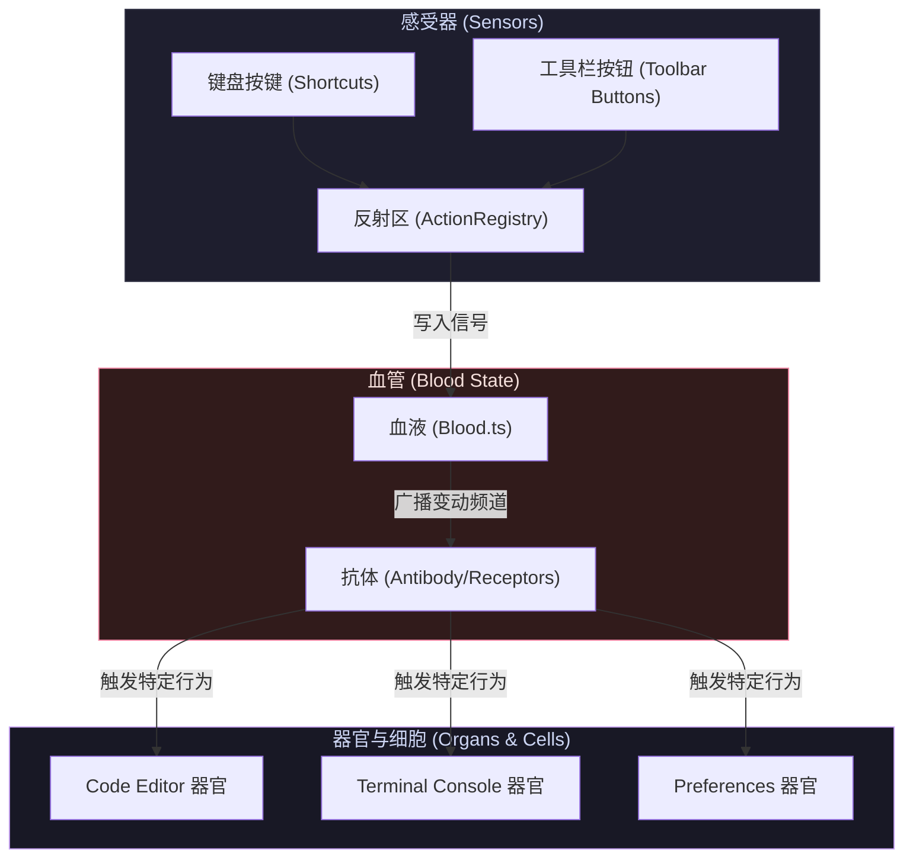

# DNOTE Workspace 💻

DNOTE 是一个基于 **TypeScript / Electron / Vite / React** 打造的现代化、高可定制性桌面工作区。项目核心采用**仿生设计理念**（Biomimetic Architecture），最大程度地实现了各面板组件的模块化解耦与自治性。

---

## 🧬 仿生设计核心理念 (Biomimetic Concept)

本项目不采用传统的组件间直接通信（回调、Event Bus 等），而是模拟生物体的生命运行机制：



### 1. 🩸 血液 (Blood.ts) —— 状态管理中心
*   整个项目维持一个全局统一的单一数据源（Single Source of Truth）：`Blood` 状态机。
*   所有的组件、按钮、键盘监听器**不直接与其它组件通信，只修改 Blood 状态**。
*   状态被修改后，`Blood` 会向所有订阅的器官广播哪些“频道（State Keys）”发生了变化。

### 2. 🫀 器官 (Organs) —— 模块化插件
*   位于 `APP/` 目录下的组件都是“器官”（Plugins）。例如：
    *   **File Explorer (FileTree.tsx)**：文件管理器。
    *   **Code Editor (Editor.tsx)**：代码编辑器。
    *   **Terminal Console (Terminal.tsx)**：多标签终端控制台。
    *   **Preferences (Settings.tsx)**：个性化配置与快捷键录制页面。
*   **插件即是组件即是应用本身**。器官在运行时可以自由被销毁、复用或任意组合。

### 3. 🛡️ 器官抗体 (Antibodies / Receptors) —— 反应接收体
*   器官内部通过 React 响应式钩子 `useBloodChannel` 或 `useOrganAntibody` 作为“抗体”。
*   收到血液广播后，抗体检查自己关注的频道是否有变化，无变化则不做响应，有变化则立即执行对应的细胞反应程序（如保存文件、清空终端历史）。
*   执行完毕后，抗体负责将血液中的事件触发器状态复位（重置为 `false` 或 `null`），防止重复触发。

---

## 🛠️ 核心功能子系统 (Subsystems)

### 1. 🎛️ 窗口排版布局引擎 ([LayoutEngine.tsx](file:///Users/apexwave/Desktop/DNOTE/CORE/LayoutEngine.tsx))
*   基于 Blender 风格的递归网格分割算法。
*   支持拖拽分栏边界实时改变尺寸比例。
*   支持拖拽面板头部标题：
    *   在面板边缘放置时：**网格拼合分割（Merge Split）**。
    *   拖拽至窗口物理边界外时：**独立弹出辅助窗口（Window Popout）**（利用 Electron IPC 新开辟渲染进程窗口）。
    *   在辅助窗口点击“归位”或关闭时：**平滑合并回主格栅窗口**。

### 2. ⌨️ 动作与快捷键反射系统 ([ActionRegistry.ts](file:///Users/apexwave/Desktop/DNOTE/CORE/ActionRegistry.ts))
*   通过 `ActionRegistry` 收集注册的所有动作和快捷键。
*   **动态装配**：插件在 `ComponentRegistry` 注册时，会自动向反射系统注册其支持 of Action、默认快捷键（Shortcut）以及对应的头部工具栏按钮。
*   **多实例隔离**：按快捷键时，系统通过 `focusedAreaId` 智能将动作路由到目前处于 Focus 状态下的那个具体面板实例中，实现多个编辑器实例的独立热键响应。
*   **本地持久化**：用户自定义快捷键会以 JSON 结构序列化并存储至 [dnote_shortcuts.json](file:///Users/apexwave/Desktop/DNOTE/dnote_shortcuts.json)。支持在设置面板中进行物理 3D 键帽交互录制和一键 Reset。

---

## 📂 项目目录结构 (Directory Structure)

```
DNOTE/
├── CORE/                        # 核心系统层 (System Core)
│   ├── main.ts                  # Electron 主进程 (窗口管理、系统文件及 Shell 桥接)
│   ├── preload.ts               # 渲染层 IPC 隔离安全沙箱桥接器
│   ├── Blood.ts                 # 仿生状态管理器 (Blood)
│   ├── Antibody.ts              # 器官反应受体 Hook (useOrganAntibody)
│   ├── ComponentRegistry.ts     # 器官组件注册表 (插件装配注册)
│   ├── ActionRegistry.ts        # 全局动作与键盘热键注册中心
│   ├── LayoutEngine.tsx         # 递归网格分栏渲染引擎
│   ├── AreaShell.tsx            # 面板外观装饰器 (包含拖拽、分栏、合并、工具按钮注入)
│   ├── App.tsx                  # 渲染主入口 (集成右侧工具栏、快捷键监听)
│   ├── index.css                # 全局 UI 样式系统 (高级暗黑、毛玻璃、3D 实体键帽)
│   └── vite-env.d.ts            # 样式与构建类型声明文件
│
├── APP/                         # 仿生器官插件层 (Organ Plugins)
│   ├── FileTree.tsx             # 真实目录浏览器 (File Explorer)
│   ├── Editor.tsx               # 实例隔离的代码编辑器 (Code Editor)
│   ├── Terminal.tsx             # 独立 Shell 分页的多标签终端 (Terminal Console)
│   └── Settings.tsx             # 个性化首选项与热键录制页面 (Preferences)
│
├── dnote_shortcuts.json         # 用户自定义键盘快捷键配置文件
├── package.json                 # 项目依赖与开发/构建脚本
└── tsconfig.json                # TypeScript 编译器配置
```

---

## 🚀 启动与开发 (Get Started)

### 安装依赖
```bash
npm install
```

### 启动本地热重载开发服务器 (Concurrent Electron & Vite)
```bash
npm run dev
```

### 静态类型检查
```bash
npx tsc --noEmit
```

### 生产打包构建
```bash
npm run build
```
