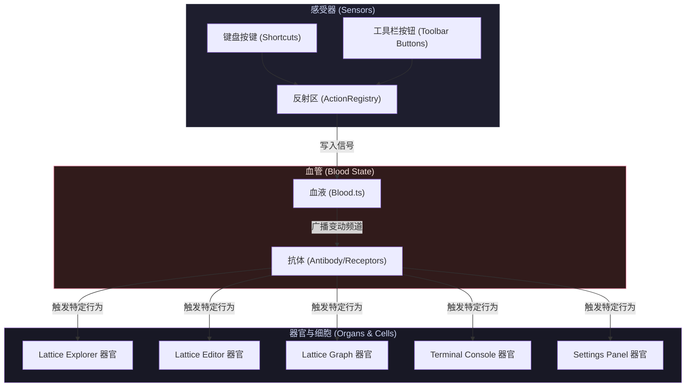

# DNOTE Workspace 💻

DNOTE 是一个基于 **TypeScript / Electron / Vite / React** 打造的现代化、高可定制性桌面工作区。项目核心采用**仿生设计理念**（Biomimetic Architecture），最大程度地实现了各面板组件的模块化解耦与自治性。

---

## 🧬 仿生设计核心理念 (Biomimetic Concept)

本项目不采用传统的组件间直接通信（回调、Event Bus 等），而是模拟生物体的生命运行机制：



### 1. 🩸 血液 (Blood.ts) —— 状态管理中心
*   整个项目维持一个全局统一的单一数据源（Single Source of Truth）：`Blood` 状态机。
*   所有的组件、按钮、键盘监听器**不直接与其它组件通信，只修改 Blood 状态**。
*   状态被修改后，`Blood` 会向所有订阅的器官广播哪些“频道（State Keys）”发生了变化。

### 2. 🫀 器官 (Organs) —— 模块化插件
*   位于 `APP/` 目录下的组件都是“器官”（Plugins）。例如：
    *   **Lattice Explorer (file-tree/)**：文件及标签目录管理器（解析 YAML 标签与运行生命周期脚本）。
    *   **Lattice Editor (editor/)**：实例隔离的代码及 YAML 属性编辑器，支持 Draft 未保存模式。
    *   **Lattice Graph (graph-view/)**：力导向拓扑关系图谱，支持 Hill Node 算法非线性缩放及色板（Palette）管理。
    *   **Obsidian Link Graph (link-graph/)**：Obsidian 风格的双向链接图谱，实时扫描解析 WikiLinks 并在 2D 力导向画布上渲染笔记关联拓扑，支持幻影节点与物理模拟参数微调。
    *   **Terminal Console (terminal/)**：基于 xterm.js 的独立多标签 Shell 终端。
    *   **Settings Panel (settings/)**：自定义首选项、3D 实体键帽快捷键录制及一键 Reset 页面。
*   **插件即是组件即是应用本身**。器官在运行时可以自由被销毁、复用或任意组合。

### 3. 🛡️ 器官抗体 (Antibodies / Receptors) —— 反应接收体
*   器官内部通过 React 响应式钩子 `useBloodChannel` 或 `useOrganAntibody` 作为“抗体”。
*   收到血液广播后，抗体检查自己关注的频道是否有变化，无变化则不做响应，有变化则立即执行对应的细胞反应程序（如保存文件、清空终端历史）。
*   执行完毕后，抗体负责将血液中的事件触发器状态复位（重置为 `false` 或 `null`），防止重复触发。

---

## 🛠️ 核心功能子系统 (Subsystems)

### 1. 🎛️ 窗口排版布局引擎 ([LayoutEngine.tsx](file:///Users/apexwave/Desktop/DNOTE/CORE/LayoutEngine.tsx))
*   基于 Blender 风格的递归网格分割算法。
*   支持拖拽分栏边界实时改变尺寸比例。
*   支持拖拽面板头部标题：
    *   在面板边缘放置时：**网格拼合分割（Merge Split）**。
    *   拖拽至窗口物理边界外时：**独立弹出辅助窗口（Window Popout）**（利用 Electron IPC 新开辟渲染进程窗口）。
    *   在辅助窗口点击“归位”或关闭时：**平滑合并回主格栅窗口**。

### 2. ⌨️ 动作与快捷键反射系统 ([ActionRegistry.ts](file:///Users/apexwave/Desktop/DNOTE/CORE/ActionRegistry.ts))
*   通过 `ActionRegistry` 收集注册的所有动作和快捷键。
*   **动态装配**：插件在 `ComponentRegistry` 注册时，会自动向反射系统注册其支持 of Action、默认快捷键（Shortcut）以及对应的头部工具栏按钮。
*   **多实例隔离**：按快捷键时，系统通过 `focusedAreaId` 智能将动作路由到目前处于 Focus 状态下的那个具体面板实例中，实现多个编辑器实例的独立热键响应。
*   **本地持久化**：用户自定义快捷键会以 JSON 结构序列化并存储至 [dnote_shortcuts.json](file:///Users/apexwave/Desktop/DNOTE/dnote_shortcuts.json)。支持在设置面板中进行物理 3D 键帽交互录制和一键 Reset。

---

## 📂 项目目录结构 (Directory Structure)

```
DNOTE/
├── CORE/                        # 核心中枢系统层 (System Core)
│   ├── main.ts                  # Electron 主进程 (窗口管理、生命周期、安全 Shell 及文件 I/O 桥接)
│   ├── preload.ts               # 渲染层 IPC 隔离安全沙箱桥接器
│   ├── App.tsx                  # 渲染主入口 (渲染网格系统、右侧动作工具栏、键盘监听)
│   ├── Blood.ts                 # 仿生双向血液状态总线 (Blood)
│   ├── BloodChannels.ts         # 统一血液频道命名空间声明 (Blood Channel Spec)
│   ├── ComponentRegistry.ts     # 器官插件自动化加载与依赖校验中心
│   ├── ActionRegistry.ts        # 全局动作与键盘热键注册中心
│   ├── LayoutEngine.tsx         # 网格排版分割及辅助窗口弹出/合并引擎
│   ├── AreaShell.tsx            # 器官面板外观装饰器 (包含焦点的感觉输入转译、拖拽和 actions 绑定)
│   ├── RightSidebar.tsx         # 统一动作工具栏 (右侧边栏)
│   ├── SettingsModal.tsx        # 键盘热键录制弹窗与快捷键个性化设定
│   ├── index.css                # 全局 UI 样式系统 (高级暗黑、毛玻璃、3D 实体键帽)
│   └── index.tsx                # React 挂载入口
│
├── APP/                         # 仿生器官插件层 (Organ Plugins)
│   ├── file-tree/               # 真实目录浏览器 (Lattice Explorer)
│   │   ├── index.ts             # 插件入口与 manifest 依赖定义
│   │   ├── FileTree.tsx         # Explorer UI 主组件 (支持 YAML 标签/正则/脚本解析展示)
│   │   ├── tagResolver.ts       # YAML 标签多轮循环与 Python 脚本计算引擎
│   │   ├── useProjectLifecycle.ts# 项目生命周期工作流控制 (on_project_open / run / close)
│   │   └── actions/             # 新建文件、切换目录动作定义
│   ├── editor/                  # 实例隔离的代码编辑器 (Lattice Editor)
│   │   ├── index.ts             # 插件入口
│   │   ├── Editor.tsx           # 编辑器 UI 主组件 (支持 draft 模式、Yaml 标签显示与删除)
│   │   ├── MarkdownPreview.tsx  # 支持拖拽媒体文件、WikiLink 导航的预览组件
│   │   ├── TagToolbar.tsx       # YAML / Regex / Python 标签交互管理条
│   │   ├── editorUtils.ts       # YAML 标签内容替换工具
│   │   ├── actions/             # 保存、切换编辑模式、删除文档动作定义
│   │   └── hooks/               # useMediaDrop, useLinkNavigator 等逻辑钩子
│   ├── graph-view/              # 拓扑关系力导向图 (Lattice Graph)
│   │   ├── index.ts             # 插件入口
│   │   ├── GraphView.tsx        # 关系图 UI 主组件 (包含 Hill Node 衰减计算与 Palette 颜色管理)
│   │   ├── GraphControls.tsx    # 浮动折叠参数调节面板
│   │   ├── actions/             # 缩放、居中、色板动作定义
│   │   └── services/
│   │       └── lattice.py       # Python 多维度层级极小化（Transitive Reduction）计算脚本
│   ├── link-graph/              # 双链关系图谱 (Obsidian Link Graph)
│   │   ├── index.ts             # 插件入口
│   │   ├── LinkGraphView.tsx    # 2D力导向模拟与关系图谱主渲染组件
│   │   └── actions/             # 缩放、重置视角动作定义
│   ├── terminal/                # 独立分页的 Shell 终端 (Terminal Console)
│   │   ├── index.ts             # 插件入口
│   │   ├── Terminal.tsx         # 终端 UI 主组件 (基于 xterm.js 桥接)
│   │   └── actions/             # 清空终端动作定义
│   ├── settings/                # 首选项控制台 (Settings Panel)
│   │   ├── index.ts             # 插件入口
│   │   └── Settings.tsx         # 快捷键 Reset 和设置显示主组件
│   └── utils.ts                 # 共享的 yaml 标签解析和同步标签计算工具
│
├── dnote_shortcuts.json         # 用户自定义键盘快捷键配置文件
├── package.json                 # 项目依赖与开发/构建脚本
└── tsconfig.json                # TypeScript 编译器配置
```

---

## 🚀 启动与开发 (Get Started)

### 安装依赖
```bash
npm install
```

### 启动本地热重载开发服务器 (Concurrent Electron & Vite)
```bash
npm run dev
```

### 静态类型检查
```bash
npx tsc --noEmit
```

### 生产打包构建
```bash
npm run build
```

---

## 📅 待开发功能清单 (Roadmap & Backlog)

项目接下来阶段计划开发以下功能，以进一步增强搜索、模板化和文档编辑体验：

### 1. 🔍 搜索增强与多维度查询 (Lattice Explorer)
*   **查询维度区分**：支持前缀查询，如 `tag:dog` 匹配特定标签，普通输入匹配文档名；支持混合过滤。
*   **多标签联合查询**：支持多标签逻辑交/并集查询（如 `tag:狗 tag:聪明`）。
*   **正则支持**：支持以 `/pattern/i` 形式进行文档名及标签的正则表达式检索。

### 2. 📂 模板实例化支持 (Lattice Explorer)
*   **模板管理弹窗**：提供类似于色板管理（Palette Manager）的磨砂玻璃弹窗，允许用户在项目 `temple/` 目录下选择模板来实例化笔记。
*   **文档命名工作流**：在选定模板后弹出对话框提示用户命名笔记，确认后再克隆文件。
*   **安全加载沙盒**：所有未克隆的模板文件均隔离存放在项目根目录的 `temple/` 目录下，且在正式被添加到项目之前**不触发执行**内部的任何 `run:` 脚本标签，确保加载时的性能和安全性。

### 3. ✍️ 设为模板动作 (Lattice Editor)
*   **一键归档模板**：在编辑器右侧工具栏注册 `editor.setAsTemplate` 动作，支持将当前文档内容直接保存到项目根目录的 `temple/` 目录下，并更新模板管理器状态。

### 4. 🚀 Notion 级 Markdown 编辑体验 (Lattice Editor)
*   **斜杠指令菜单**：支持 `/` 指令快捷唤起排版元素菜单（如 `/h1`, `/code`, `/todo` 等），通过键盘上下选择并回车即时应用。
*   **快捷填充与更改样式**：支持全面的 Markdown 文本快捷键组合（如 `meta+b` 粗体、`meta+k` 超链接等），提供沉浸且丝滑的富文本编辑感。
