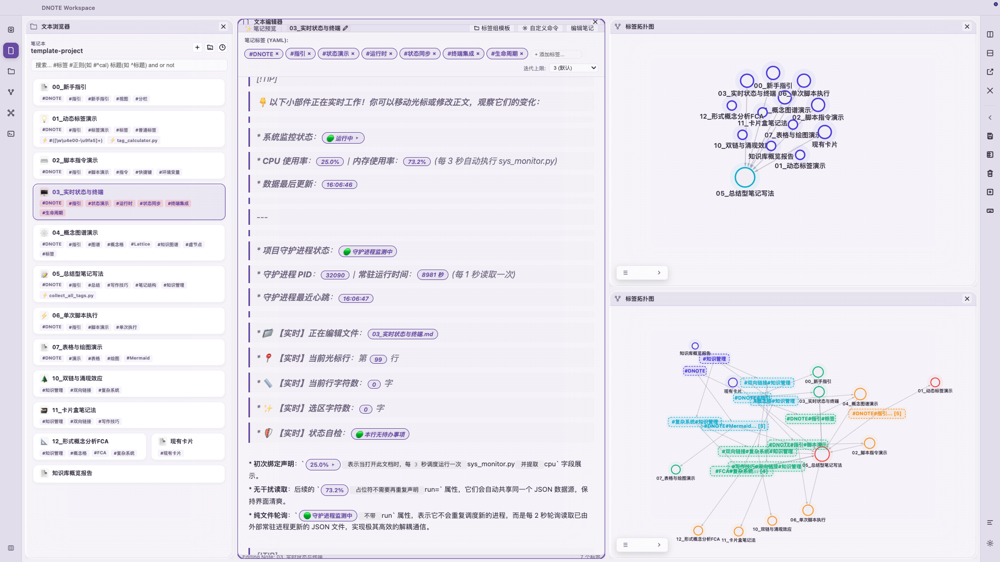
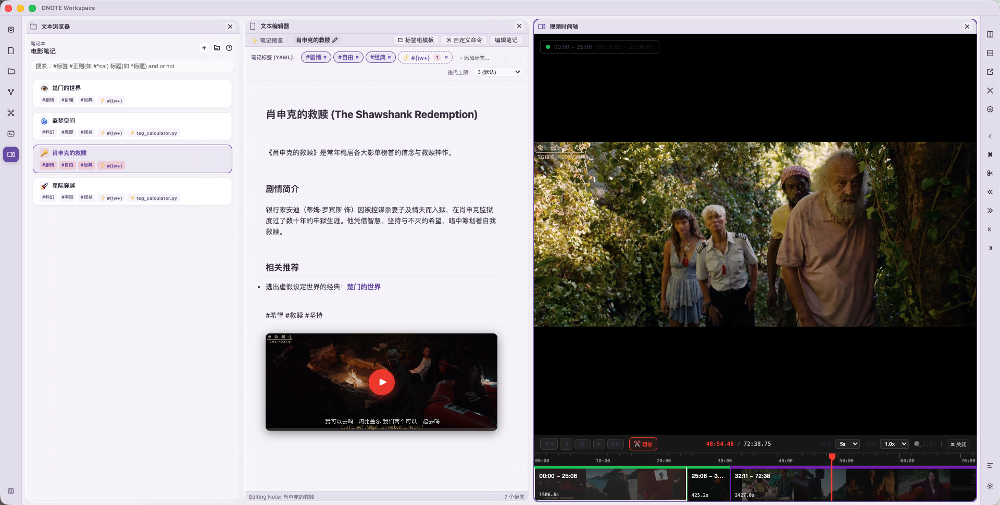

# DNOTE Workspace 💻

DNOTE 是一个基于 **TypeScript / Electron / Vite / React** 打造的现代化、高可定制性桌面工作区。项目核心采用**仿生设计理念**（Biomimetic Architecture），最大程度地实现了各面板组件的模块化解耦与自治性。




---

## 🚀 启动与开发 (Get Started)

### ⚡ 一键快捷启动 (One-Click Start Script)

我们提供了一键自动化运行脚本 [run.sh](file:///Users/apexwave/Desktop/DNOTE/run.sh)，该脚本会自动检查 Node.js 环境，自动配置 Astral uv Python 环境管理器，自动拉取并安装 `node_modules` 依赖，并修复 macOS 系统下的 xterm `node-pty` 权限，最后自启热更新服务：

```bash
chmod +x run.sh
./run.sh
```

### 🛠️ 手动分步运行 (Manual Steps)

如果你希望分步安装和执行，可以使用以下标准开发命令：

#### 1. 安装依赖
```bash
npm install
```

#### 2. 启动本地热重载开发服务器 (Concurrent Electron & Vite)
```bash
npm run dev
```

#### 3. 静态类型检查
```bash
npx tsc --noEmit
```

#### 4. 生产打包构建
```bash
npm run build
```

### ⚠️ 平台适配与兼容性说明 (OS Compatibility Notice)

> [!IMPORTANT]
> **DNOTE 目前仅深度适配了 macOS 系统**。
>
> 核心部分（如 `node-pty` 终端权限修复、局部命令路径分隔符、部分底层 Shell 通道等）均针对 macOS 进行设计与优化。如果您在 **Windows** 或 **Linux** 系统下运行本软件，可能需要微调环境依赖及启动路径（例如对 `run.sh` 脚本和 `package.json` 中的构建配置进行平台微调），方能完美运行。

---

## 🧮 核心技术特性 (Core Technical Features)

### 1. 🕸️ 概念格与形式概念分析 (Formal Concept Analysis & Relation Discovery)

DNOTE 内置了**形式概念分析（Formal Concept Analysis, FCA）**引擎。它不仅能展示普通的双向链接，还能从海量笔记中自动挖掘和发现知识概念的层次包含关系：

*   **对象-属性形式背景构建**：将**笔记文档**视为“形式对象”（Objects），将文档中包含的**知识标签**视为“形式属性”（Attributes）。FCA 引擎会实时扫描所有笔记，建立二元关系矩阵。
*   **伽罗瓦连接与概念自动推导**：基于数学上的 Galois Connection，系统自动归纳出“最大共性概念”（即包含相同属性子集的最大对象集合，以及包含相同对象子集的最大属性集合），生成概念格（Concept Lattice）。
*   **层次包含关系自动发现**：通过概念格的拓扑层级结构，系统能自动挖掘出标签之间的蕴含关系（Implications）。例如，若包含 `#机器学习` 的笔记总是包含 `#人工智能`，概念格拓扑图谱中将自动生成指向关系。这无需用户手动建立父子标签，实现了自底向上的知识树演化与层次拓扑发现。

### 2. 🐍 复杂 Python 脚本高级支持与异步血流闭环 (Advanced Python Scripting & Asynchronous Loop)

为了提供极高的自由度与强大的计算能力，DNOTE 深度集成了对复杂 Python 脚本的调用支持：

*   **动态标签计算器 (Dynamic Tag Resolvers)**：支持配置并运行 Python 动态脚本。脚本能接收并扫描当前文档内容，运行复杂的自然语言处理（NLP）或统计学模型，并按照约定的 JSON 标准通过标准输出（stdout）将解析结果返回给 DNOTE 主进程，实现动态标签计算与标签自动填充。
*   **静默后台指令执行 (`commands.json` & Slash Menu)**：定义在 `commands.json` 中的高级指令可以指定运行外部复杂的 Python 脚本（如 `sys_monitor.py` 或双链图谱优化算法 `lattice.py`）。主进程通过异步子进程安全地运行这些脚本，不会阻塞前端 UI 的渲染和输入响应。
*   **基于缓存与血液的事件闭环**：
    1. Python 脚本在后台独立运行，执行大量 CPU 密集型计算。
    2. 计算完成后，脚本将结果静默写入 `.dnote_cache/` 缓存文件夹。
    3. 脚本退出时通过主进程广播血液事件 `events.commandExecuted.{id}`。
    4. 对应面板器官的“抗体”（Antibody）监听到血液信号变化，自动读取对应的缓存文件并刷新 UI。这种设计完全解耦了核心进程，保证了编辑器的丝滑体验。

### 3. 🔌 极简模块化插件与即插即用开发 (Modular Plug-and-Play Plugins & Easy Extension)

DNOTE 核心采用极简且松耦合的**器官/插件架构**，无论是面板组件还是计算脚本，均实现了高内聚与即插即用：

*   **插件超好开发**：所有功能面板（如文件树、编辑器、各种关系图谱、终端）均作为独立“器官”存放在 `APP/` 下。新增插件只需建立独立文件夹，编写简单的 React 视图组件并导出配置即可。Vite 拥有自动发现与热重载机制，无需重新打包，在主界面网格菜单中即可一键加载并实时调试。
*   **状态解耦即插即用**：各组件绝不直接和其它组件进行复杂的回调耦合，而是通过轻量级的 Blood 血液总线进行单向频道订阅（State Channels）。这使得任何面板在运行时可以自由被销毁、复用、或者任意组合分割（Blender 风格分栏），无需担心接口断裂。
*   **动作与反射隔离**：所有面板动作和热键（如保存、新建、自定义指令）均由 `ActionRegistry` 收集注册，并依据当前 Focus 的实例进行智能路由隔离。配合 `commands.json`，您可以轻松定义和装配各种后台脚本，极大地扩展系统功能。

### 4. 🚀 内置 Google Antigravity (AGY) 智能代理辅助开发 (Google Antigravity AGY Agent-Driven Development)

DNOTE 内置并无缝集成了 **Google Antigravity (AGY) 智能代理** 开发套件：

*   **一句话搞定插件开发、脚本编写与正则匹配**：依托于项目内置的 `.agents/` 仿生开发规范（`AGENTS.md`）和定制化的技能库（Skills），无论是开发新的 React 器官视图、编写复杂的 Python 数据计算管道，还是编写高难度的正则表达式，开发者仅需向 Antigravity 智能代理发出“一句话指令”。代理将完美理解前后端解耦规范与血液总线命名空间，自动安全地完成代码编写、冲突自检并推送远程，极大释放生产力。

### 5. 🔄 完整的项目与页面生命周期/循环钩子 (Comprehensive Project & Document Lifecycle Hooks)

DNOTE 提供了一套完整的项目级和页面级生命周期与循环调度脚本钩子，让笔记系统的自动化处理逻辑能紧密配合用户的使用阶段：

*   **项目级生命周期脚本 (Project Lifecycle)**：在打开、运行或关闭笔记本目录时，DNOTE 会自动触发对应的 Python 生命周期脚本：
    *   `on_project_open.py`：项目加载时同步阻塞运行，用于检查运行环境、建立本地数据库缓存或初始化项目配置。
    *   `on_project_run.py`：项目打开后作为守护进程常驻后台运行，支持长期监听、数据增量同步或拉起后台服务。
    *   `on_project_close.py`：项目关闭时自动触发，执行进程回收、状态归档和清理缓存等善后工作。
*   **页面级定时/循环执行钩子 (Interval Scheduler & Loop)**：对于插值表达式和反应式标签，支持设置定时周期执行（如设定 `interval: 3` 秒）。引擎会自动开启高精度定时循环运行脚本更新数据，保证状态在 UI 上实时流动。
*   **页面关闭与销毁清理钩子 (Unmount Cleanup)**：当文档被关闭、切换或面板组件销毁时，DNOTE 会触发 React 卸载销毁钩子，自动清理正在运行的定时器（`clearInterval`），并回收销毁页面独占生成的临时缓存与运行数据（如沙盒执行级别的临时 `.json` 文件），防范文件冗余，保持工作区干净清爽。
*   **文档交互生命周期环境注入 (Interactive Context)**：在打开、保存、或编辑时，DNOTE 会将实时的上下文环境变量（当前文件 `DNOTE_ACTIVE_FILE`、项目根目录 `DNOTE_PROJECT_PATH`、光标行/列数、编辑器选中文本等）注入到子进程环境中运行，脚本计算完成后通过血液事件即时流转并动态刷新编辑器状态，实现高度互动的页面生命周期。

---

## 🛠️ 核心功能子系统 (Subsystems)

### 1. 🎛️ 窗口排版布局引擎 ([LayoutEngine.tsx](file:///Users/apexwave/Desktop/Projects/GNOTE/Galois/CORE/LayoutEngine.tsx))
*   基于 Blender 风格的递归网格分割算法。
*   支持拖拽分栏边界实时改变尺寸比例。
*   支持拖拽面板头部标题：
    *   在面板边缘放置时：**网格拼合分割（Merge Split）**。
    *   拖拽至窗口物理边界外时：**独立弹出辅助窗口（Window Popout）**（利用 Electron IPC 新开辟渲染进程窗口）。
    *   在辅助窗口点击“归位”或关闭时：**平滑合并回主格栅窗口**。

### 2. ⌨️ 动作与快捷键反射系统 ([ActionRegistry.ts](file:///Users/apexwave/Desktop/Projects/GNOTE/Galois/CORE/ActionRegistry.ts))
*   通过 `ActionRegistry` 收集注册的所有动作和快捷键。
*   **动态装配**：插件在 `ComponentRegistry` 注册时，会自动向反射系统注册其支持 of Action、默认快捷键（Shortcut）以及对应的头部工具栏按钮。
*   **多实例隔离**：按快捷键时，系统通过 `focusedAreaId` 智能将动作路由到目前处于 Focus 状态下的那个具体面板实例中，实现多个编辑器实例的独立热键响应。
*   **本地持久化**：用户自定义快捷键会以 JSON 结构序列化并存储至 [dnote_shortcuts.json](file:///Users/apexwave/Desktop/Projects/GNOTE/Galois/dnote_shortcuts.json)。支持在设置面板中进行物理 3D 键帽交互录制和一键 Reset。

### 3. 🎬 视频时间轴与无损拉片系统 ([VideoTimelineView.tsx](file:///Users/apexwave/Desktop/Projects/GNOTE/Galois/APP/video-timeline/VideoTimelineView.tsx))


DNOTE 内置了**视频时间轴与无损拉片剪辑系统**，专为音视频资料整理与细粒度学术/研究拉片设计：
*   **非破坏性无损剪辑 (Non-destructive persistence)**：系统不修改原始视频文件。所有切分、标注和片段信息均以 JSON 格式持久化于项目 `.dnote_assets/videos/<video_name>.asset.json` 目录中。
*   **高精度帧级定位与缩放 (Frame-accurate zoom & Navigation)**：
    *   **指针锚定缩放**：时间轴的缩放比例（Zooming）会自动根据当前播放头（Playhead）指针位置作为锚点进行平滑缩放，保证缩放时播放线始终稳定在视野中心。
    *   **帧级微调**：支持使用键盘 `,` (逗号) 与 `.` (句号) 进行逐帧后退/前进，实现毫秒级剪辑对齐。
*   **流式快捷键与焦点隔离 (Focused Hotkeys)**：
    *   通过 `ActionRegistry` 挂载全局/局域快捷键反射：`Space` 控制播放/暂停、`C` 在当前位置快速切分（Split）、`Left / Right` 左右箭头进行秒级快进快退。
    *   针对多面板拆分场景，实现了**焦点隔离**，确保快捷键动作精准路由至当前激活的视频播放器实例，避免多开冲突。
*   **双向交互式拉片与 Markdown 联动 (Bionic Markdown Linking)**：
    *   **拖拽引用**：在时间轴上切分出的片段卡片可以直接拖拽至 Markdown 编辑器中，自动转化为特定的富文本引用标签 `@video[片段名称](视频文件名?t=开始秒数,结束秒数)`（采用 `?t=` 参数传参，规避传统的 `#t=` 哈希值被解析为笔记标签的问题）。
    *   **独立解析与全屏播放**：Markdown 渲染引擎（`MarkdownPreview`）会自动识别该标签，并将其渲染为交互式视频卡片。点击即可控制主播放器跳转至对应区间，且支持全屏播放、充满容器布局等优化。

---

## 📂 项目目录结构 (Directory Structure)

```
DNOTE/
├── CORE/                        # 核心中枢系统层 (System Core)
│   ├── main.ts                  # Electron 主进程 (窗口管理、生命周期、安全 Shell 及文件 I/O 桥接)
│   ├── preload.ts               # 渲染层 IPC 隔离安全沙箱桥接器
│   ├── App.tsx                  # 渲染主入口 (渲染网格系统、右侧动作工具栏、键盘监听)
│   ├── Blood.ts                 # 仿生双向血液状态总线 (Blood)
│   ├── BloodChannels.ts         # 统一血液频道命名空间声明 (Blood Channel Spec)
│   ├── ComponentRegistry.ts     # 器官插件自动化加载与依赖校验中心
│   ├── ActionRegistry.ts        # 全局动作与键盘热键注册中心
│   ├── LayoutEngine.tsx         # 网格排版分割及辅助窗口弹出/合并引擎
│   ├── AreaShell.tsx            # 器官面板外观装饰器 (包含焦点的感觉输入转译、拖拽和 actions 绑定)
│   ├── RightSidebar.tsx         # 统一动作工具栏 (右侧边栏)
│   ├── SettingsModal.tsx        # 键盘热键录制弹窗与快捷键个性化设定
│   ├── index.css                # 全局 UI 样式系统 (高级暗黑、毛玻璃、3D 实体键帽)
│   └── index.tsx                # React 挂载入口
│
├── APP/                         # 仿生器官插件层 (Organ Plugins)
│   ├── file-tree/               # 真实目录浏览器 (Lattice Explorer)
│   │   ├── index.ts             # 插件入口与 manifest 依赖定义
│   │   ├── FileTree.tsx         # Explorer UI 主组件 (连接并装配各拆分模块)
│   │   ├── FileCard.tsx         # 单个笔记卡片渲染组件
│   │   ├── searchHelpers.ts     # 关键字过滤与正则检索辅助函数
│   │   ├── tagResolver.ts       # YAML 标签多轮循环与 Python 脚本计算引擎
│   │   ├── useProjectHistory.ts # 管理打开的笔记本历史记录
│   │   ├── useProjectLifecycle.ts# 项目生命周期工作流控制 (on_project_open / run / close)
│   │   ├── actions/             # 新建文件、切换目录动作定义
│   │   └── [Modals]             # PromptModal, TemplateModal, IconPickerModal, HistoryProjectsMenu
│   │
│   ├── editor/                  # 实例隔离的代码编辑器 (Lattice Editor)
│   │   ├── index.ts             # 插件入口
│   │   ├── Editor.tsx           # 编辑器 UI 主组件 (布局与模态窗挂载)
│   │   ├── MarkdownPreview.tsx  # 支持拖拽媒体文件、WikiLink 导航的预览组件
│   │   ├── TagToolbar.tsx       # YAML / Regex / Python 标签交互管理条
│   │   ├── editorUtils.ts       # YAML 标签内容替换工具
│   │   ├── actions/             # 保存、切换编辑模式、删除文档动作定义
│   │   ├── hooks/               # useMediaDrop, useLinkNavigator, useEditorHistory
│   │   └── [Modals/Menus]       # ShortcutsModal, CustomCommandsModal, TagGroupsModal, SlashMenu, PromptModal
│   │
│   ├── graph-view/              # 拓扑关系力导向图 (Lattice Graph)
│   │   ├── index.ts             # 插件入口
│   │   ├── GraphView.tsx        # 关系图 UI 主组件 (连接并装配物理模拟与控制)
│   │   ├── GraphControls.tsx    # 浮动折叠参数调节面板
│   │   ├── helpers.ts           # 节点物理坐标缩放/宽度计算辅助函数
│   │   ├── types.ts             # Node 与 Link 接口定义
│   │   ├── useLatticeData.ts    # FCA 拓扑格数据加载与节点度数计算 hook
│   │   ├── usePhysicsSimulation.ts # D3-Force 粒子模拟与防震拖拽物理引擎 hook
│   │   ├── actions/             # 缩放、居中、色板动作定义
│   │   ├── SelectedNodeDrawer.tsx# 侧边选中节点详情抽屉
│   │   ├── PaletteManagerModal.tsx# 调色盘管理器弹窗
│   │   └── services/
│   │       └── lattice.py       # Python 多维度层级极小化（Transitive Reduction）计算脚本
│   │
│   ├── agent/                   # 智能助理代理插件 (Antigravity CLI Agent)
│   │   ├── index.ts             # 插件入口
│   │   ├── Agent.tsx            # 智能代理 UI 主组件
│   │   ├── MessageList.tsx      # 历史消息气泡流渲染
│   │   ├── MessageInput.tsx     # 输入框与快捷发送组件
│   │   ├── SettingsDrawer.tsx   # 大模型厂商与模型参数配置抽屉
│   │   ├── types.ts             # ChatMessage 消息定义
│   │   ├── useLLMSettings.ts    # LLM 状态与本地存储同步 hook
│   │   └── actions/             # 快捷呼出代理、重置对话动作定义
│   │
│   ├── video-timeline/          # 视频时间轴剪辑插件 (Video Timeline & Slicer)
│   │   ├── index.ts             # 插件入口与 manifest 依赖定义
│   │   ├── VideoTimelineView.tsx# 视频播放器与时间轴剪辑 UI 主组件
│   │   └── actions/             # 播放/暂停、切分视频、步进帧/跳转动作定义
│   │
│   ├── link-graph/              # 双链关系图谱 (Obsidian Link Graph)
│   │   ├── index.ts             # 插件入口
│   │   ├── LinkGraphView.tsx    # 2D力导向模拟与关系图谱主渲染组件
│   │   └── actions/             # 缩放、重置视角动作定义
│   │
│   ├── terminal/                # 独立分页的 Shell 终端 (Terminal Console)
│   │   ├── index.ts             # 插件入口
│   │   ├── Terminal.tsx         # 终端 UI 主组件 (基于 xterm.js 桥接)
│   │   └── actions/             # 清空终端动作定义
│   │
│   ├── settings/                # 首选项控制台 (Settings Panel)
│   │   ├── index.ts             # 插件入口
│   │   └── Settings.tsx         # 快捷键 Reset 和设置显示主组件
│   └── utils.ts                 # 共享的 yaml 标签解析和同步标签计算工具
│
├── dnote_shortcuts.json         # 用户自定义键盘快捷键配置文件
├── package.json                 # 项目依赖与开发/构建脚本
└── tsconfig.json                # TypeScript 编译器配置
```

---

## 🔌 独立开发与拓展自定义插件 (Organ Plugin Development)

DNOTE 采用了高度松耦合的**器官 (Organ) 插件机制**。任何开发者在本地拉取代码后，均可自由在 `APP/` 下新建或修改插件，无需重新打包：

1. **新建插件文件夹**：
   在 `APP/` 目录下新建一个以插件命名的文件夹，例如 `APP/my-custom-plugin/`。
2. **编写插件入口 (`index.ts`)**：
   创建 `APP/my-custom-plugin/index.ts`，导出满足 DNOTE `AreaComponent` 规范的插件配置：
   ```typescript
   import { MyCustomView } from './MyCustomView';
   import { BC } from '../../CORE/BloodChannels';

   export const MyCustomPlugin = {
     typeId: 'myCustomPlugin',          // 全局唯一标识
     displayName: '我的自定义插件',      // 界面显示名称
     iconName: 'star',                 // 界面图标
     component: MyCustomView,          // UI 视图组件
     bloodChannels: [                  // 订阅的血液状态频道
       BC.system.projectPath
     ],
     manifest: {
       description: '描述你的插件功能...',
       reads: [BC.system.projectPath],
       writes: []
     }
   };
   ```
3. **编写 React 视图组件 (`MyCustomView.tsx`)**：
   直接在文件夹根目录下编写 React 组件：
   ```typescript
   import React from 'react';

   export function MyCustomView({ state, updateBloodKey }: any) {
     const projectPath = state[BC.system.projectPath] || '';
     return (
       <div style={{ padding: '12px', color: 'var(--text-main)' }}>
         <h3>自定义插件面板</h3>
         <p>当前项目：{projectPath}</p>
       </div>
     );
   }
   ```
4. **实时热重载调试**：
   在终端运行 `npm run dev`。Vite 拥有自动发现机制（`import.meta.glob`），它会自动扫描、注册并加载您的新插件。您可以在编辑器右上角的网格布局菜单中选择切换为您刚才新加的 `我的自定义插件`，编写 TSX 时界面会实时热重载更新。
