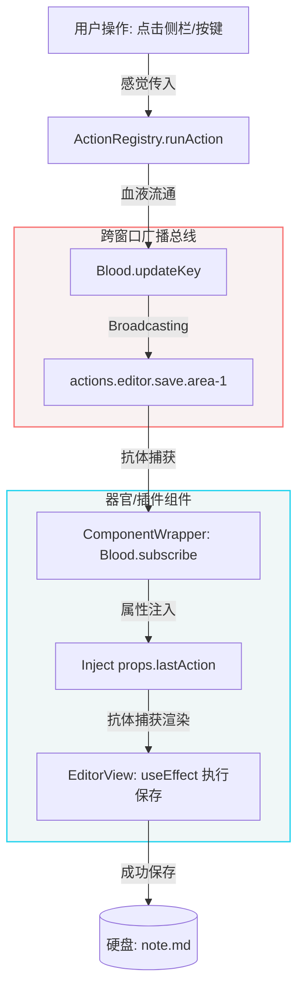
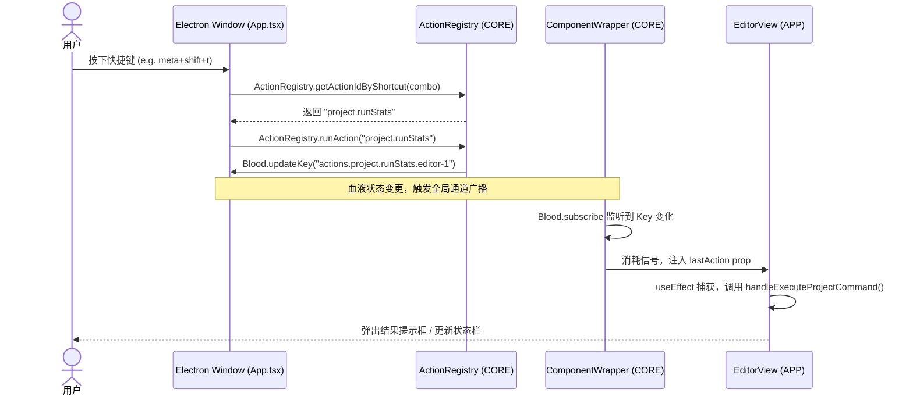

---
tags:
  - DNOTE
  - 演示
  - 表格
  - 绘图
  - Mermaid
---
# 📊 Markdown 表格与 Mermaid 关系图表演示

本笔记专门用于演示 DNOTE 的全新排版排版与图表计算能力：**Markdown 表格渲染** 与 **Mermaid 流程图/时序图动态生成**。

---

## 1. 📊 高级 Markdown 表格展示

我们现在完整支持标准 GFM 表格，并且支持在单元格内执行**加粗**、*斜体*、`代码块`、[[00_新手指引|双向 Wiki 链接]] 以及 **`{{ 动态/实时插值小部件 }}`**！

| 功能组件 | 作用域 (`scope`) | 支持的标记与宏 | 对齐示例 (左中右) |
| :--- | :---: | :--- | ---: |
| **Markdown 表格** | `editor` | 支持内嵌 **粗体**、`code`、双链 | 居右对齐 ￥100 |
| **Mermaid 绘图** | `editor` | 流程图、时序图、甘特图等 | 居右对齐 ￥200 |
| **标准代码块** | `editor` | 多行缩进、代码字体、背景隔离 | 居右对齐 ￥300 |

> [!TIP]
> 移动鼠标指针到表格上方，你会发现它完全适配了 DNOTE 主题系统的斑马纹和细边框样式，具有极佳的视觉可读性。

---

## 2. 💻 标准多行代码块

非 `mermaid` 的普通代码块会被完美包裹在代码盒内，提供字族隔离与横向溢出滚动：

```python
# 这是一个简单的 Python 示例，演示如何写回 DNOTE cache 文件夹
import json
import os

def write_cache(command_id, data):
    project_path = os.environ.get("DNOTE_PROJECT_PATH", ".")
    output_file = os.environ.get("DNOTE_OUTPUT_FILE", f"{project_path}/.dnote_cache/{command_id}.json")
    
    os.makedirs(os.path.dirname(output_file), exist_ok=True)
    with open(output_file, "w", encoding="utf-8") as f:
        json.dump(data, f, ensure_ascii=False, indent=2)
    print(f"Cache successfully written to {output_file}")
```

---

## 3. 🧬 Mermaid 动态关系图谱

你现在可以直接在 Markdown 中书写三反引号包裹的 `mermaid` 代码，编辑器在加载时会动态渲染为 SVG 矢量网格。

### A. 仿生反射链路图 (Flowchart)
以下流程图清晰展示了 DNOTE 最核心的**血液循环反射模式**（血液注入 ── 抗体捕获）：



### B. 感觉-动作反射时间序 (Sequence Diagram)
下面是一个更加精确的时序图，描述了用户按下全局快捷键后，CORE 与 APP 的双向流动契约：



---

## 4. 🧪 语法容错验证演示 (故障安全)

如果编写的 Mermaid 图表代码中包含语法错误，DNOTE 不会崩溃，而是会安全地展示一个折叠排错框。以下是一个**故意包含语法错误**的渲染框演示：

```mermaid
graph TD
    A --> B
    B == 错误线 (这行语法是错的，应为 B --> C) == C
```

---

## 🔗 相关双链导航
- [[00_新手指引]] — 返回系统主功能路线图。
- [[01_动态标签演示]] — 学习如何让标签与数据实现联动。
